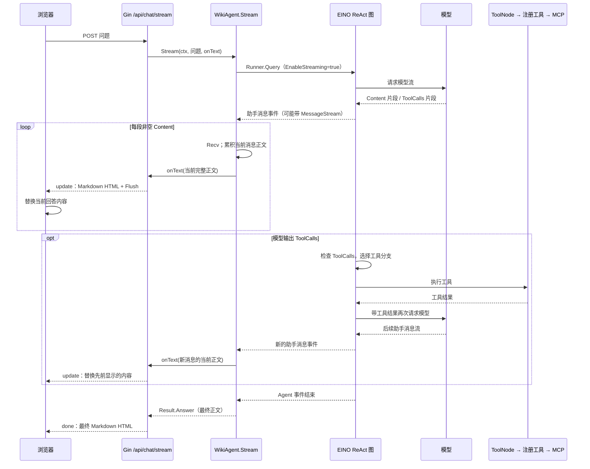

# 流式回答：从模型到网页

这份说明对应当前仓库的 [Agent 代码](../internal/agent/wiki_agent.go)、[Web 接口](../internal/web/server.go) 和[页面脚本](../internal/web/static/index.html)。核心区别是两层循环：EINO 在内部决定是否调用工具；本项目只消费 EINO 向外提供的事件，并把助手正文转发给页面。

## 一次提问经过哪里

图中的工具分支是**逻辑顺序**；模型流的事件转发与 EINO 对流的分支检查在框架内协同进行，不能把图理解为每个网络字节严格按箭头顺序到达。

## `onText` 究竟是什么

`onText` 是 `Stream` 的第三个参数，类型为 `func(string) error`。它不是模型或 EINO 自动提供的钩子，而是 [Web 的 `streamChat`](../internal/web/server.go) 定义、再传给 `s.agent.Stream(...)` 的 Go 函数：

1. `consumeMessage` 从 `MessageStream.Recv()` 取出一个非空 `Content` 片段，追加到这条助手消息的 `strings.Builder`。
2. 它调用 `onText(content.String())`。传入的是**当前这条消息截至此刻的完整 Markdown**，不是单个片段，也不是历次工具调用的内容。
3. Web 回调使用 Goldmark 把它转成 HTML，编码为一行 `{"type":"update","html":"..."}`，写入 HTTP 响应并 `Flush()`。
4. 浏览器的 `fetch` 通过 `ReadableStream` 读取字节；一旦拼出完整的一行 JSON，就将 HTML 放进现有的助手回答区域。浏览器的网络分块不一定与模型片段或服务端的单次 `Flush` 一一对应。

这是同步回调：若 Web 写入失败，错误会从 `onText` 返回到 `consumeMessage` 和 `Stream`，本轮不再继续读取。`MessageStream.Recv()` 返回 `io.EOF` 只代表**当前消息**结束；外层 `iter.Next()` 返回 `ok=false` 才代表**整轮 Agent**结束。此时 Web 发送 `done`。如果中途出错且连接仍在，Web 发送 `error` 事件。

## 工具调用在哪里被发现

`consumeMessage` 没有检查 `ToolCalls`，也不会主动调用 MCP。工具在构造 Agent 时通过 [RegisterTools](../internal/tool/registry/eino.go) 登记。`Runner.Query` 启动 EINO 的 ReAct 图后，EINO 的 `toolCallCheck` 会检查模型流中的 `chunk.ToolCalls`：

- 没有工具调用：该次模型输出走结束分支。
- 出现工具调用：进入 `ToolNode`，按名称执行已注册的工具。本项目的[执行包装层](../internal/tool/registry/execution.go)先校验 Wiki 路径、参数和输出范围，再调用 MCP。
- EINO 将工具结果加入本轮消息，再次请求模型；如果模型继续要求工具，重复上述过程，直到模型给出回答或本轮报错。

这段分支和回环可在当前依赖版本 [EINO v0.9.19 `adk/react.go` 的 `toolCallCheck` 与图边](https://github.com/cloudwego/eino/blob/v0.9.19/adk/react.go#L495-L559)看到。EINO 的 [`MessageVariant`](https://github.com/cloudwego/eino/blob/v0.9.19/adk/interface.go#L61-L105)也说明了完整消息、消息流与 `Role` 的关系。

本项目只把 `Role == Assistant` 的 `Content` 交给 `onText`。结构化的 `ToolCalls` 片段通常没有正文，因此不会触发页面更新；`Role == Tool` 的结果会被消费，但不会作为助手回答显示。如果模型在调用工具前先写了一段普通文字，这段文字可以先显示；工具执行后新助手消息的 `onText` 从空正文重新累积，页面会替换为新的回答。

## 从哪里开始读代码

1. [页面 `fetch('/api/chat/stream')`](../internal/web/static/index.html)：创建回答区域、逐行解析 `update` / `done` / `error`。
2. [Web `streamChat`](../internal/web/server.go)：构造 `onText`，渲染 Markdown，写出并 `Flush`。
3. [Agent `Stream` 和 `consumeMessage`](../internal/agent/wiki_agent.go)：`Runner.Query`、`iter.Next`、`MessageStream.Recv`。
4. [工具注册与执行](../internal/tool/registry/eino.go)：本项目给 EINO 哪些工具，以及调用 MCP 前的约束。
5. [EINO 官方流式读取示例](https://github.com/cloudwego/eino-examples/blob/main/quickstart/chat/stream.go)：`Recv` 到 `io.EOF` 后关闭消息流的基本写法。
