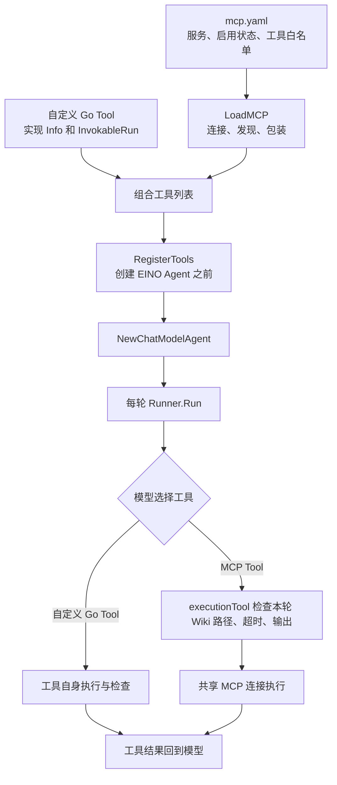

# Tool Registry：从注册到调用

**Tool Registry 接受两类工具：项目自己实现的 Go Tool，以及从 MCP 服务发现的 Tool。** 当前运行配置只启用了 MCP Tool；这只是现阶段的选择，注册入口已经支持普通 Go Tool。两类工具都以 EINO 的 `tool.BaseTool` 交给 Agent，由 EINO 按名称调用。



## 构造阶段：在哪里、何时注册

1. **准备自定义工具**：在项目代码中实现 EINO 工具接口，例如 `tool.InvokableTool`（`Info` 返回名称和参数定义，`InvokableRun` 执行调用）。把实例加入工具列表。自定义工具无需写进 `mcp.yaml`。
2. **准备 MCP 工具**：在 `mcp.yaml` 的 `servers` 中声明服务、`enabled`、`tools` 白名单，以及需要绑定当前 Wiki 的 `path_parameters`；`config.yaml` 的 `mcp.registry_file` 指向该文件。`LoadMCP(appCtx, cfg.MCP)` 在首次调用时连接服务并发现工具，之后复用同一 Manager。
3. **合并并注册**：在 `NewWikiAgent` 中准备 `agentConfig`，合并两类工具，调用 `RegisterTools`，然后调用 `adk.NewChatModelAgent`。注册在 **Agent 构造时完成一次**，不能等到 `Runner.Run` 后才补上。当前代码位于 `internal/agent/wiki_agent.go`。

当前项目只有 MCP 工具，构造顺序是：

```go
manager, err := registry.LoadMCP(appCtx, cfg.MCP)
if err != nil { return nil, err }
mcpTools, err := manager.Tools()
if err != nil { return nil, err }
registry.RegisterTools(agentConfig, mcpTools)
agent, err := adk.NewChatModelAgent(appCtx, agentConfig)
```

以后新增项目自己的 Tool，只需在同一位置加入列表，例如：

```go
ownTools := []tool.BaseTool{newWikiStatsTool()}
allTools := append(ownTools, mcpTools...)
registry.RegisterTools(agentConfig, allTools)
```

采用 `tool.InvokableTool` 时，需要实现 `Info(context.Context) (*schema.ToolInfo, error)` 和 `InvokableRun(context.Context, string, ...tool.Option) (string, error)`。仓库中的 [测试工具示例](../internal/agent/wiki_agent_reuse_test.go) 展示了这两个方法。也可以先把自定义工具放进 `agentConfig.ToolsConfig.Tools`；`RegisterTools` 会与传入的工具合并。两种写法选一种，并确保工具名唯一，避免重复注册。

## 运行阶段：什么时候调用、怎样复用

每次请求调用 `Runner.Run` 时，传入本轮 context；Web 层选定的 `WikiRoot` 已放在 `runcontext.Metadata` 中。模型产生工具调用后，EINO 用工具名选中已注册对象，执行并把结果回填给模型。

```go
runCtx := runcontext.With(ctx, runcontext.Metadata{WikiRoot: wikiRoot})
runner := adk.NewRunner(runCtx, adk.RunnerConfig{Agent: agent})
iter := runner.Run(runCtx, messages)
```

自定义 Go Tool 的 `InvokableRun` 直接接收这份 context，应在自身实现中检查所需参数和权限。MCP Tool 会先经过 `executionTool.InvokableRun`：按当前 Wiki 检查声明的路径参数，应用具体工具限制，再通过共享 MCP 连接调用服务，并限制超时和输出。这个包装只用于 MCP Tool，不会自动套到自定义 Tool 上。

`Tools()` 只复制切片，工具对象和连接仍共享；同一应用生命周期和 MCP 配置下，多个 Agent 可以复用它们。`RegisterTools` 为 EINO v0.9.19 的并发运行在**每轮**注入同一组工具对象，不在每轮重新连接或发现 MCP。单轮结束只取消该次调用；应用 context 取消时 Manager 才关闭共享连接。

代码阅读顺序：`manager.go` 加载与复用、`eino.go` 注册、`execution.go` MCP 调用边界。MCP 安装与配置细节见 [MCP 接入说明](mcp.md)。
